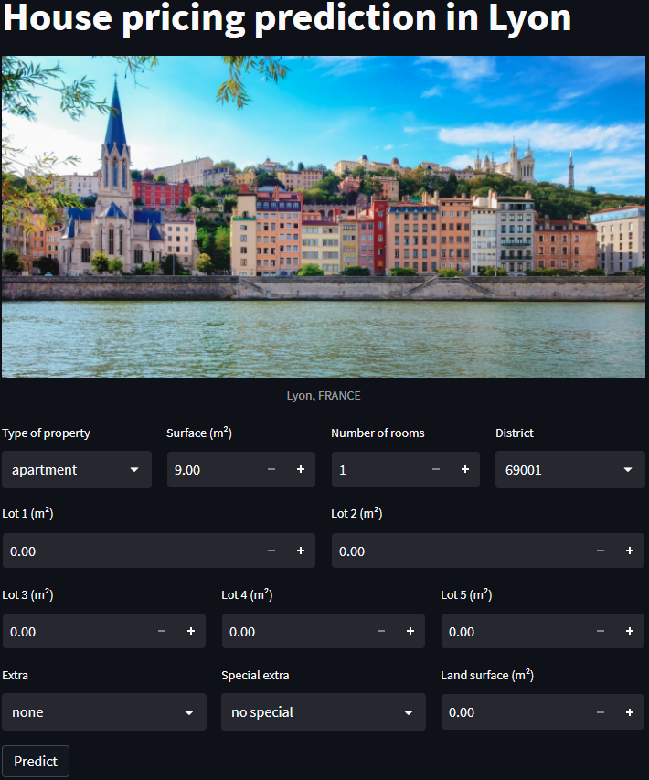

# House price prediction in Lyon

## Overview

This is a house price prediction app that uses a Random Forest Regressor to the predict the price of houses in the French city of Lyon. The model was trained on a dataset of 44000+ properties from ["Demandes de valeurs foncières géolocalisées](https://www.data.gouv.fr/fr/datasets/demandes-de-valeurs-foncieres-geolocalisees/) and has a r2 score of 0.7029.



## Installation & Run

1. Clone the repository
```sh
git clone https://github.com/MiTiX1/house-price-prediction.git
```
2. Install the required packages
```sh
pip install -r requirements.txt
```
3. Run
```sh
streamlit run main.py
```